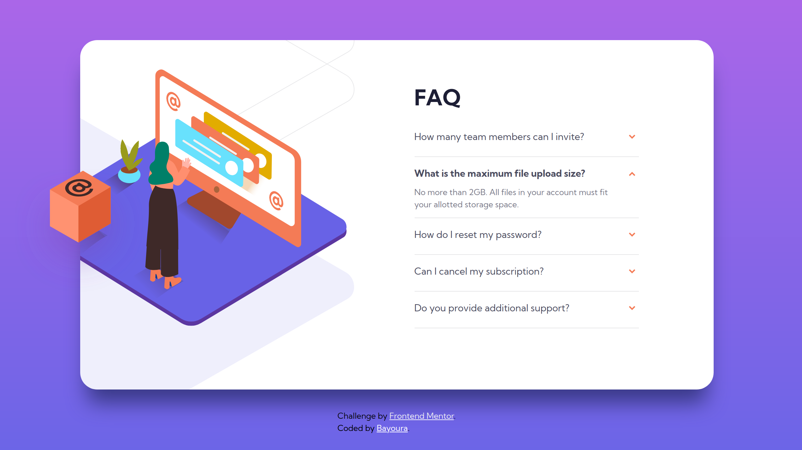

# FAQ-Accordion

## Links

- [View Code](https://github.com/Bayoura/accordion-card)
- [Live Demo](https://bayoura.github.io/accordion-card/)

## Built with

- HTML
- CSS
- Flexbox
- Vanilla JavaScript
- mobile first workflow

## What I learned

- I built an accordion with JS and CSS. It was rather simple, but it's a handy skill to have.
- I also learned more about the HTML tags `summary` and `details` which you can also use to achieve the accordion-effect (I decided against using those because I wanted to get more into JS)
- The most difficult thing about this project was the positioning of the images, especially because you had to layer them on top of each other.

## Author

- [codepen](https://codepen.io/bayoura)
- [GitHub](https://github.com/Bayoura)
- [Frontend Mentor](https://www.frontendmentor.io/profile/Bayoura)